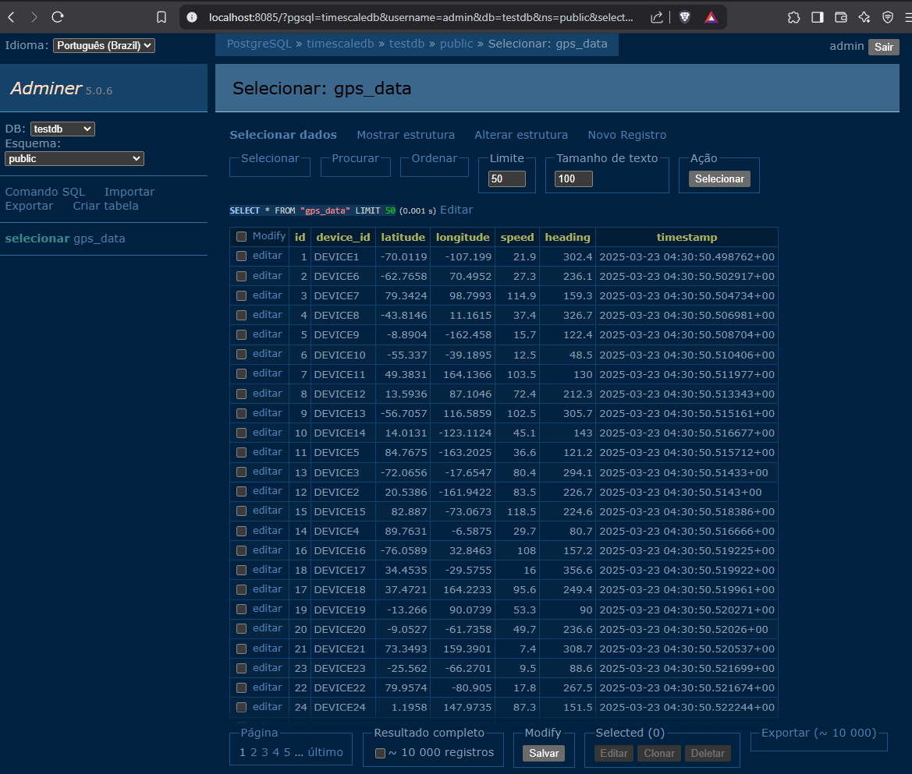

# **Instruções para Executar a Aplicação de Teste com TimescaleDB**

Este projeto consiste em um servidor que recebe dados via TCP, processa e os armazena em um banco de dados **TimescaleDB**, e um cliente que envia dados simulados para o servidor. Além disso, é possível visualizar os dados no TimescaleDB através de uma interface web.

### **Estrutura do Projeto**

- **/server/server.go**: Servidor que processa as requisições e salva os dados no TimescaleDB.
- **/client/client.go**: Cliente que envia requisições simuladas com dados GPS para o servidor.
- **Docker Compose**: Configura o **TimescaleDB** e a interface **Adminer** para visualização e gerenciamento do banco de dados.

---

### **Pré-requisitos**

- Docker
- Docker Compose
- Go (para compilar e rodar o servidor e o cliente)

---

### **Passos para Execução**

#### 1. **Configuração do Docker Compose**

O primeiro passo é configurar os containers para o **TimescaleDB** e a interface web **Adminer** para facilitar a visualização do banco de dados.

1. Navegue até a pasta raiz do projeto (onde o arquivo `docker-compose.yml` está localizado).
2. Execute o comando para iniciar os containers Docker:

```bash
docker-compose up -d
```

Isso irá criar e iniciar os containers para o TimescaleDB e a interface Adminer.

- **TimescaleDB** estará rodando na porta `5432`.
- **Adminer** (interface web para gerenciamento do banco de dados) estará disponível em `http://localhost:8085`.

#### 2. **Execução do Servidor**

Agora, vamos iniciar o servidor que ficará aguardando as conexões TCP do cliente.

1. Navegue até a pasta `/server`.
2. Compile e execute o servidor usando o Go:

```bash
go run server.go
```

O servidor estará aguardando conexões na porta `5000` e processará as requisições recebidas.
Para gerar o executável do server, rode dentro da pasta server:

```bash
go build
```

#### 3. **Execução do Cliente**

Agora, vamos executar o cliente que envia dados simulados para o servidor.

1. Navegue até a pasta `/client`.
2. Compile e execute o cliente usando o Go:

```bash
go run client.go
```

O cliente começará a enviar requisições simuladas para o servidor, e o servidor processará essas requisições e armazenará os dados no banco de dados TimescaleDB.

#### 4. **Acessando a Interface Web do TimescaleDB**

Você pode visualizar os dados armazenados no banco de dados **TimescaleDB** utilizando a interface **Adminer**:


1. Abra seu navegador e acesse o seguinte URL:

   ```
   http://localhost:8085
   ```

2. Na tela de login do Adminer, insira as credenciais do banco de dados:

   - **Servidor**: `timescaledb` (nome do container do TimescaleDB no Docker Compose)
   - **Usuário**: `admin`
   - **Senha**: `admin`
   - **Banco de dados**: `testdb`

3. Clique em **Login** e você poderá visualizar as tabelas e dados armazenados no banco de dados.

#### 5. **Testando o Sistema**

Após iniciar o servidor e o cliente, você pode verificar se os dados estão sendo armazenados corretamente no banco de dados ao acessar a interface Adminer e consultar a tabela `gps_data`. Execute o seguinte SQL para ver as entradas na tabela:

```sql
SELECT * FROM gps_data;
```

---

### **Considerações Finais**

- Certifique-se de que todos os containers estão rodando corretamente. Você pode verificar isso executando:

  ```bash
  docker ps
  ```

- O servidor e o cliente podem ser alterados para personalizar a entrada de dados, como latitude, longitude, velocidade e direção, ou para alterar a quantidade de requisições enviadas.

- Em um ambiente de produção, considere configurar a segurança da conexão com o banco de dados, como a habilitação de **SSL**.

---

### **Estrutura do Projeto**

```
/project-root
│
├── /client
│   └── client.go      # Código do cliente que envia dados para o servidor
│
├── /server
│   └── server.go      # Código do servidor que processa as requisições e salva no TimescaleDB
│
├── docker-compose.yml # Arquivo de configuração do Docker Compose
└── README.md          # Este arquivo
```

---

### **Licença**

Este projeto está sob a licença MIT. Veja o arquivo [LICENSE](LICENSE) para mais detalhes.

---

Este **README** fornece todas as instruções necessárias para você executar e testar a aplicação com Docker, servidor e cliente.